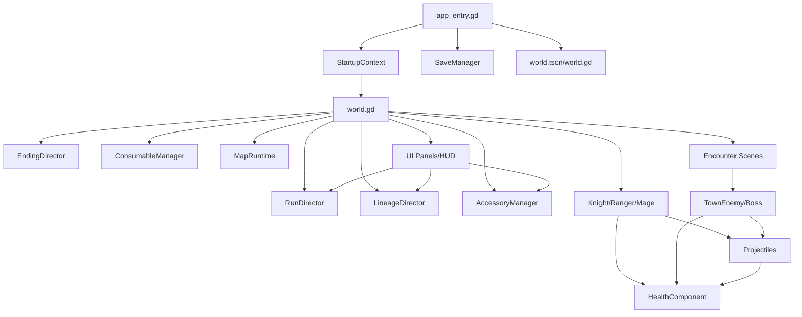

# 模块关系图

## 高层依赖

## 战斗接口约定

玩家、敌人、Boss 之间没有正式接口类，但实际约定如下：

- 可受击对象通常有 `receive_hit(payload: Dictionary)`。
- 可控对象通常有 `apply_control_effects(payload: Dictionary)`。
- 玩家对象有 `hp/max_hp/defense/max_defense/inspiration/max_inspiration/cooldowns` 等字段。
- 玩家和敌人发 `died` 或 `defeated`。
- 世界通过信号绑定音频、HUD、血条和奖励。

## 角色共同结构

三名玩家角色共享模式：

- `extends CharacterBody2D`
- 子节点 `StateMachine`
- 子节点 `HealthComponent`
- 信号：攻击、命中、技能、HP、灵感、护甲、死亡、控制状态。
- `_physics_process()` 读输入，更新 cooldown，交给 state machine，再 `move_and_slide()`。
- `_process()` 更新持续 buff、控制状态、目标显示。
- `receive_hit()` 只是包装，真正结算在 `HealthComponent`。

## 敌人共同结构

普通敌人：

- `town_enemy.gd` 用 `EnemyType` 枚举分派 AI。
- `town_mob_encounter.gd` 管波次、modifier、刷怪点和 defeated 聚合。

Boss：

- 每个 Boss 独立脚本。
- 共同字段是 `target/hp/state/state_time/cooldown/action_committed`。
- 共同信号是 `defeated`。
- 共同模式是 `_update_state()` + `_process_xxx()`。

## UI 关系

UI 大多是动态构建，不只是 `.tscn`：

- `CharacterSelect`：标题菜单、角色选择、图鉴、关于页。
- `SaveSlotSelect`：存档槽。
- `PlayModeSelect`：普通/debug 模式。
- `KnightHUD`：通用角色 HUD，名字虽然是 knight，但可绑定任意角色。
- `BattleStatus`：局内目标、威胁、金币、事件路线。
- `RunEventPanel`：事件三选一。
- `AccessoryChoice`：饰品三选一/重掷/保留。
- `StageRewardPanel`：关间奖励。
- `InventoryPanel`：局内状态、背包、饰品历史、路线信息。
- `ConsumableBar`：数字槽消耗品显示。
- `ResultScreen`：死亡/胜利/结局。

